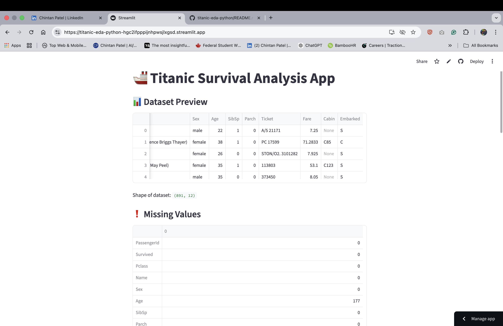
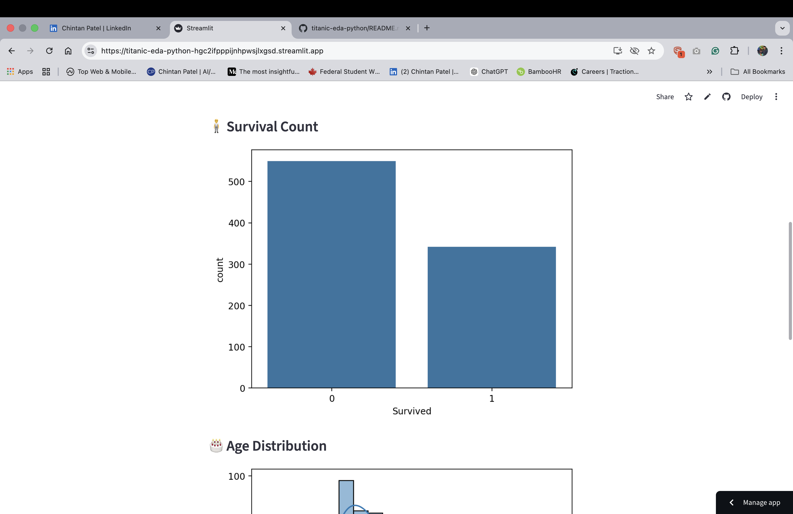
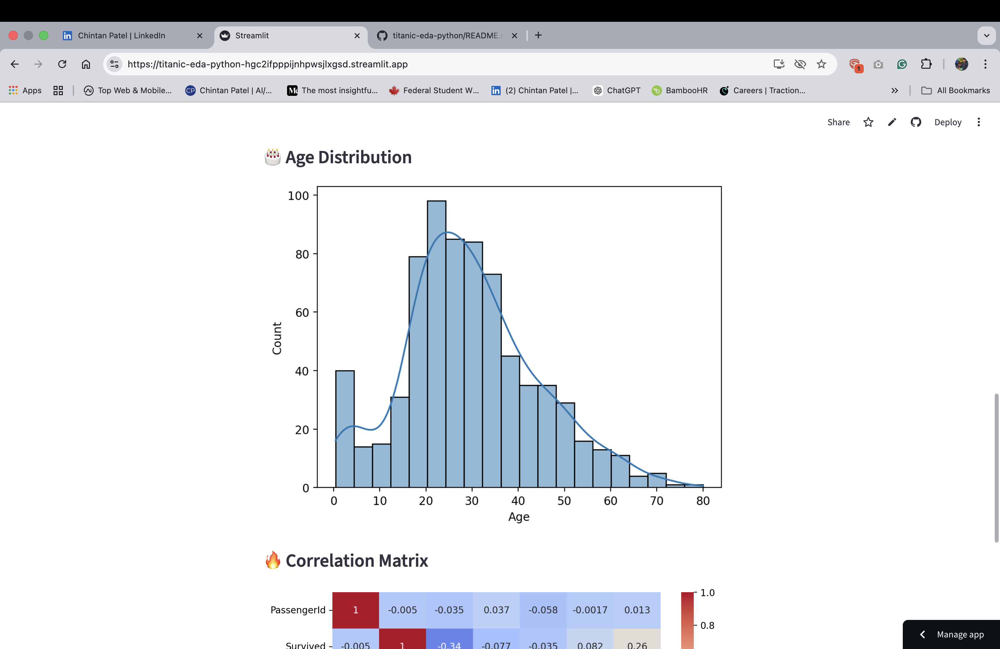
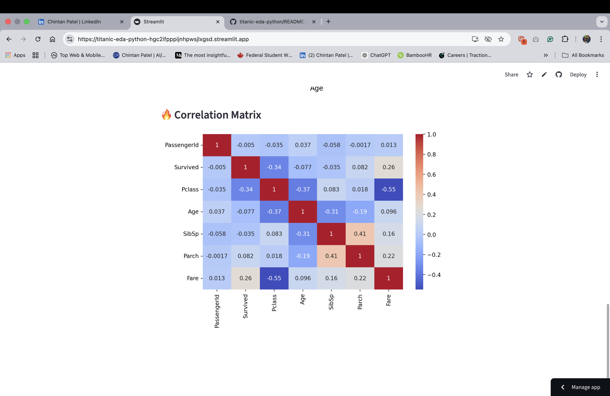

# 🚢 Titanic Survival Analysis App

🌐 **Live Demo:** https://titanic-eda-python-hgc2ifpppijhpnwsjlxgsd.streamlit.app  

This project focuses on performing **Exploratory Data Analysis (EDA)** on the Titanic dataset and presenting insights through an **interactive Streamlit web application**.

---

## 📸 App Preview

### 🏠 Dashboard

### 📸 App Preview


### 🧍 Survival Count


### 🎂 Age Distribution


### 🔥 Correlation Matrix


---

## 📊 Project Overview

The objective of this project is to understand the dataset before building any predictive models by analyzing:

- Data structure and feature types  
- Missing values and data quality  
- Relationships between variables  
- Survival patterns of passengers  

---

## ✨ Features

- Interactive data exploration using Streamlit  
- Real-time visualization of survival patterns  
- Missing value analysis  
- Age distribution visualization  
- Correlation heatmap  
- Clean and user-friendly UI  

---

## 📈 Key Insights

- Female passengers had significantly higher survival rates  
- Passengers in 1st class had better survival chances compared to lower classes  
- Age distribution indicates that most passengers were young adults  
- Passenger class and gender showed strong influence on survival outcomes  

---

## 🛠 Tools & Technologies

- Python  
- Pandas  
- NumPy  
- Matplotlib  
- Seaborn  
- Streamlit  

---

## 📂 Dataset

- Source: Kaggle Titanic Dataset  
- File used: `titanic.csv`  

---

## 📌 Project Workflow

1. Data Loading and Inspection  
2. Handling Missing Values  
3. Univariate Analysis  
4. Bivariate Analysis  
5. Data Visualization  

---

## ⚙️ Run Locally

```bash
git clone https://github.com/chintan-02/titanic-eda-python.git
cd titanic-eda-python
pip install -r requirements.txt
streamlit run titanic_app.py

## 💡 Learning Outcome

This project helped strengthen my fundamentals and build a solid foundation in:

- Data analysis  
- Data visualization  
- Problem-solving using Python  
- Building interactive data applications  

---

## 🚀 Next Steps

- Feature Engineering  
- Feature Selection  
- Machine Learning Model Building  
- Add prediction feature (Survival Prediction App)  

---

## 👨‍💻 Author

**Chintan Patel**  
🔗 GitHub: https://github.com/chintan-02  
💼 LinkedIn: https://www.linkedin.com/in/chintan-patel-987765129/  
🌐 Live App: https://titanic-eda-python-hgc2ifpppijhpnwsjlxgsd.streamlit.app  
